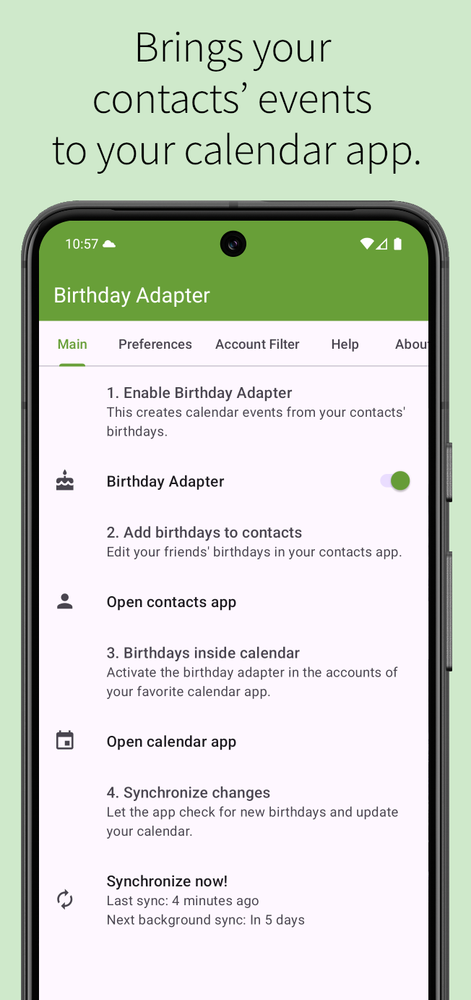
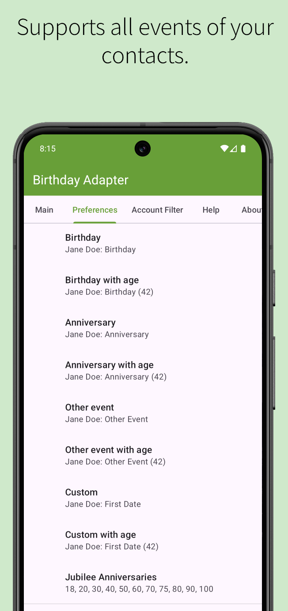
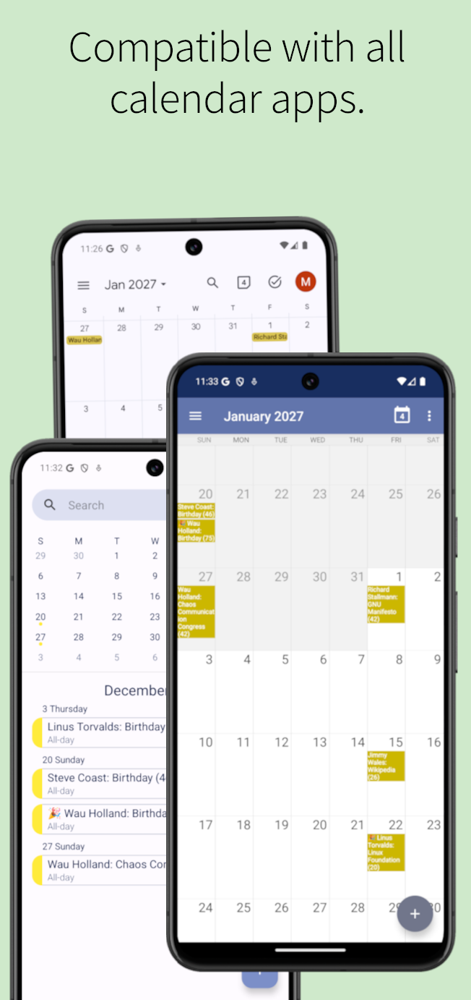
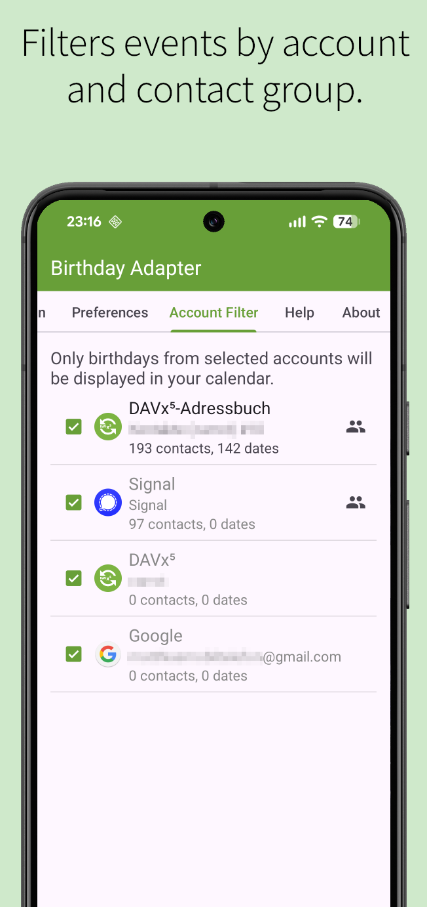
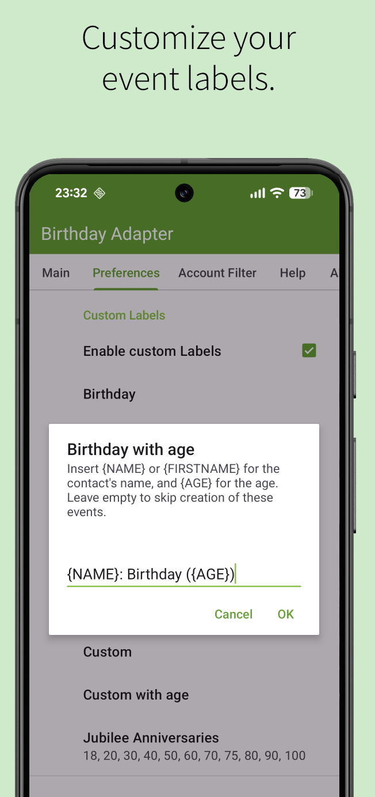
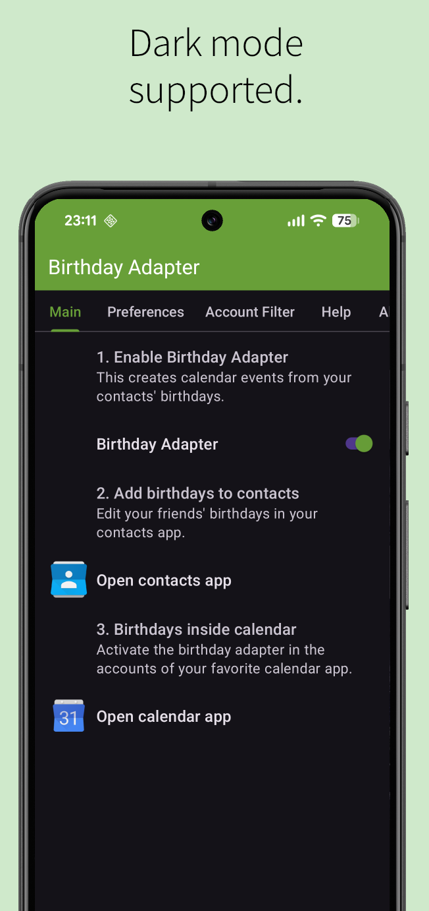
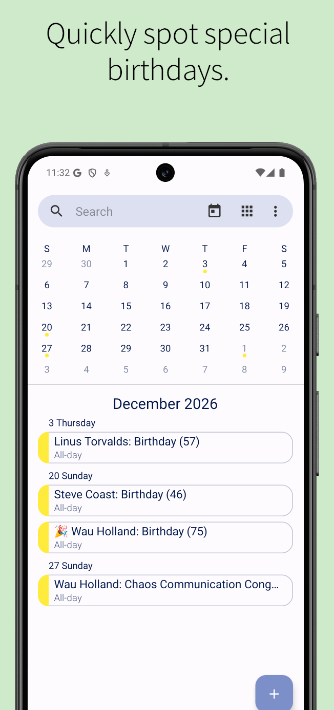
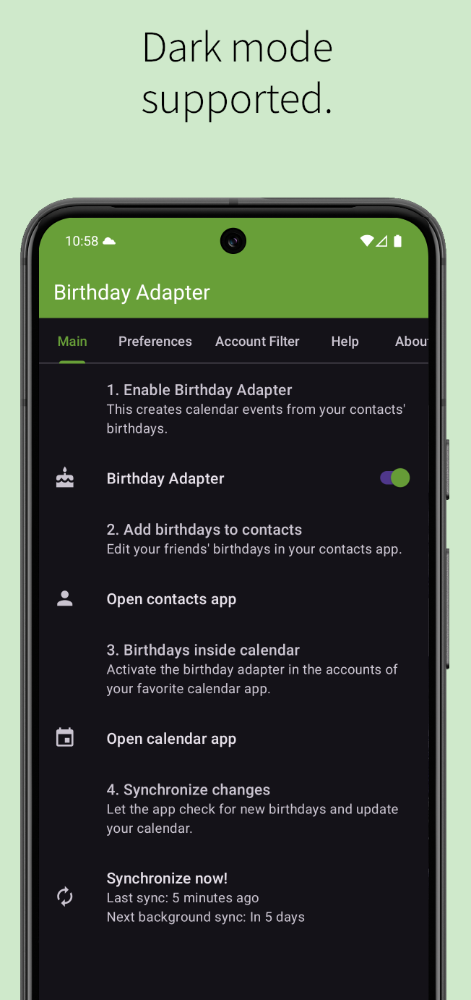

# Birthday Adapter

Birthday Adapter is the first implementation to really display all contact birthdays automatically in your standard Android calendar without hassle.

Birthday Adapter provides birthdays, anniversaries, and other events from your contacts as a real calendar, which is displayed in your standard Android calendar application. To my knowledge, this is the first implementation that implements birthdays as a real calendar integrated in the Android calendar. All other apps only displays their own lists but have no real integration! 

## Screenshots

<table style="border: none;">
  <tr>
    <th>
        
    </th>
    <th>
        
    </th>
    <th>
        
    </th>
    <th>
        
    </th>
  </tr>
  <tr>
    <th>
        
    </th>
    <th>
        
    </th>
    <th>
        
    </th>
    <th>
        
    </th>
  </tr>
</table>

## Build with Gradle

1. Have Android SDK "tools", "platform-tools", and "build-tools" directories in your PATH (http://developer.android.com/sdk/index.html)
2. Open the Android SDK Manager (shell command: ``android``). Expand the Extras directory and install "Android Support Repository"
3. Export ANDROID_HOME pointing to your Android SDK
4. Execute ``./gradlew build``

Different productFlavors are build with gradle:
- ``full``
- ``free`` without settings

## Contribute

Fork Birthday Adapter and do a Pull Request. I will merge your changes back into the main project.

## Translations

Translations are hosted on Weblate.

Help translating at https://hosted.weblate.org/engage/birthday-adapter/

## Coding Style

### Code
* Indentation: 4 spaces, no tabs
* Maximum line width for code and comments: 100
* Opening braces don't go on their own line
* Field names: Non-public, non-static fields start with m.
* Acronyms are words: Treat acronyms as words in names, yielding !XmlHttpRequest, getUrl(), etc.

See http://source.android.com/source/code-style.html

### XML
* XML Maximum line width 999
* XML: Split multiple attributes each on a new line (Eclipse: Properties -> XML -> XML Files -> Editor)
* XML: Indent using spaces with Indention size 4 (Eclipse: Properties -> XML -> XML Files -> Editor)

See http://www.androidpolice.com/2009/11/04/auto-formatting-android-xml-files-with-eclipse/

## Licenses
Birthday Adapter is licensed under the GPLv3+.
The file LICENSE includes the full license text.

### Details
Birthday Adapter is free software: you can redistribute it and/or modify
it under the terms of the GNU General Public License as published by
the Free Software Foundation, either version 3 of the License, or
(at your option) any later version.

Birthday Adapter is distributed in the hope that it will be useful,
but WITHOUT ANY WARRANTY; without even the implied warranty of
MERCHANTABILITY or FITNESS FOR A PARTICULAR PURPOSE.  See the
GNU General Public License for more details.

You should have received a copy of the GNU General Public License
along with Birthday Adapter.  If not, see <http://www.gnu.org/licenses/>.

### Libraries
* AndroidX Libraries
  https://developer.android.com/jetpack/androidx
  Apache License 2.0

* Gemini support in Android Studio

### Images

* icon.svg
  Based on Tango Icon Library and Tango Pidgin Icon Theme
  http://tango.freedesktop.org/
  Public Domain (Tango Icon Library) and GPL (Tango Pidgin Icon Theme)
