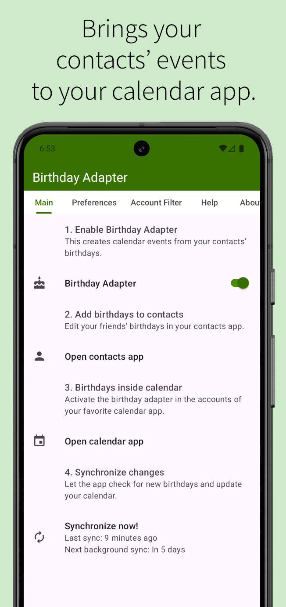
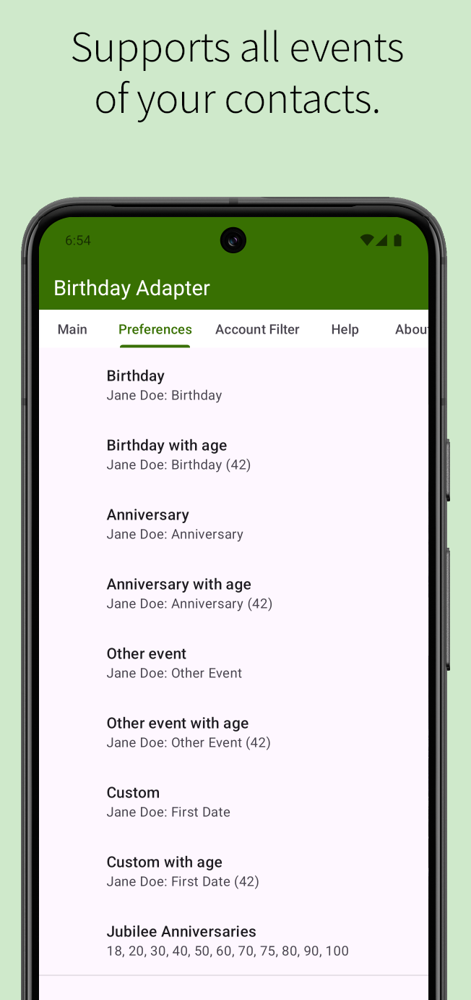
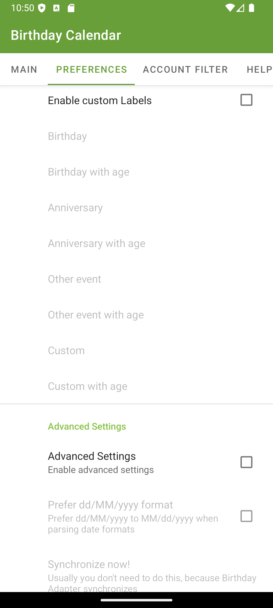
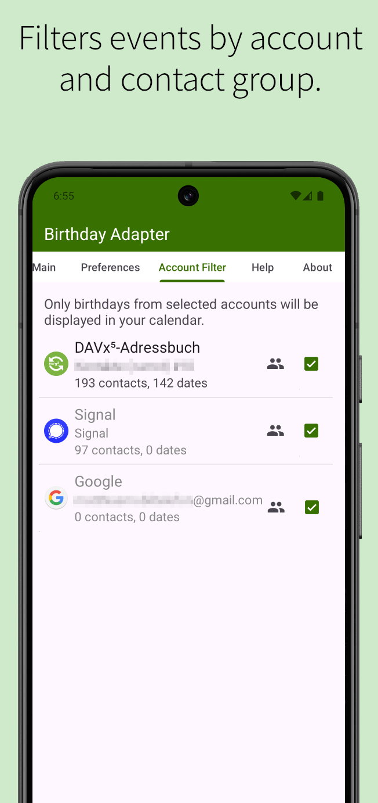
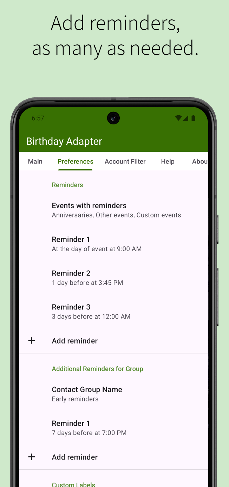
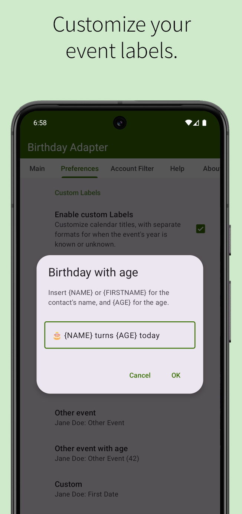
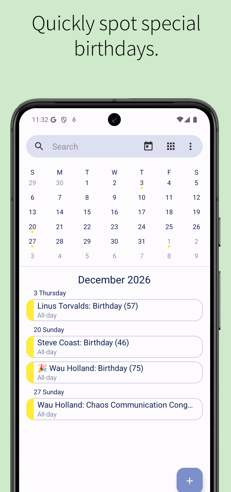
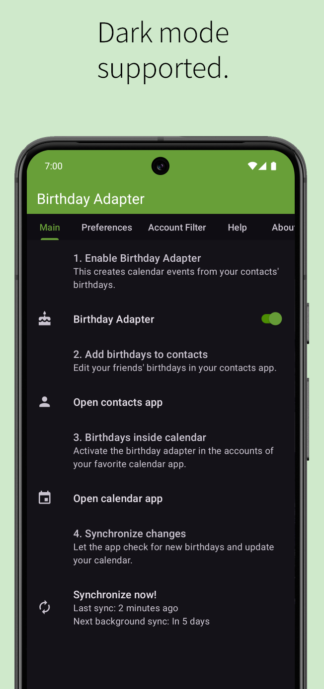

# Birthday Adapter

[](https://f-droid.org/app/org.birthdayadapter)
&nbsp; &nbsp; &nbsp;
[](https://play.google.com/store/apps/details?id=fr.heinisch.birthdayadapter)

Birthday Adapter syncs birthdays, anniversaries, and other events from your contacts directly into
your Android calendar. Unlike other apps, it integrates seamlessly with your system calendar, so you
can see all your important dates alongside your other events.

## Screenshots

<table style="border: none;">
  <tr>
    <th>
        <a href="metadata/en-US/images/phoneScreenshots/01.png" target="_blank">
         </a>
    </th>
    <th>
        <a href="metadata/en-US/images/phoneScreenshots/02.png" target="_blank">
         </a>
    </th>
    <th>
        <a href="metadata/en-US/images/phoneScreenshots/03.png" target="_blank">
         </a>
    </th>
    <th>
        <a href="metadata/en-US/images/phoneScreenshots/04.png" target="_blank">
         </a>
    </th>
  </tr>
  <tr>
    <th>
        <a href="metadata/en-US/images/phoneScreenshots/05.png" target="_blank">
         </a>
    </th>
    <th>
        <a href="metadata/en-US/images/phoneScreenshots/06.png" target="_blank">
         </a>
    </th>
    <th>
        <a href="metadata/en-US/images/phoneScreenshots/07.png" target="_blank">
         </a>
    </th>
    <th>
        <a href="metadata/en-US/images/phoneScreenshots/08.png" target="_blank">
         </a>
    </th>
  </tr>
</table>


## Translations

Translations are hosted on Weblate.

Help translating at https://hosted.weblate.org/engage/birthday-adapter/

<a href="https://hosted.weblate.org/engage/birthday-adapter/">

</a>


## Building the Project

The easiest way to build the project is to open it in [Android Studio](https://developer.android.com/studio).
Android Studio will handle the download of the required SDK and build tools.

You can also build the project from the command line using Gradle:
```bash
./gradlew assemble
```

### Product Flavors

The project contains two product flavors:
- `free`: The freemium version of the app.
- `full`: The full version with all features unlocked.

You can build a specific variant, for example `freeDebug`, by running:
```bash
./gradlew assembleFreeDebug
```


## Contribute

We welcome contributions! Please start by opening an issue to let us know what you’re working on.

Then, Fork Birthday Adapter and do a Pull Request. I will merge your changes back into the main project.


## Coding Style

The project generally follows the standard [Android code style guidelines](http://source.android.com/source/code-style.html).

The code is formatted using the default Android Studio formatter. You can
reformat any file using `Code -> Reformat Code`.

## Licenses
Birthday Adapter is licensed under the GPLv3+.
The file LICENSE includes the full license text.

### Details
Birthday Adapter is free software: you can redistribute it and/or modify
it under the terms of the GNU General Public License as published by
the Free Software Foundation, either version 3 of the License, or
(at your option) any later version.

Birthday Adapter is distributed in the hope that it will be useful,
but WITHOUT ANY WARRANTY; without even the implied warranty of
MERCHANTABILITY or FITNESS FOR A PARTICULAR PURPOSE.  See the
GNU General Public License for more details.

You should have received a copy of the GNU General Public License
along with Birthday Adapter.  If not, see <http://www.gnu.org/licenses/>.

### Libraries
* AndroidX Libraries
  https://developer.android.com/jetpack/androidx
  Apache License 2.0

* Gemini support in Android Studio

### Images

* icon.svg
  Based on Tango Icon Library and Tango Pidgin Icon Theme
  http://tango.freedesktop.org/
  Public Domain (Tango Icon Library) and GPL (Tango Pidgin Icon Theme)

## Donations

If you would like to provide a financial contribution, you can show your
support by donating via [Liberapay](https://liberapay.com/mattitude/donate)
or [PayPal](https://www.paypal.com/donate/?hosted_button_id=74N2SGUSHWPWL).
